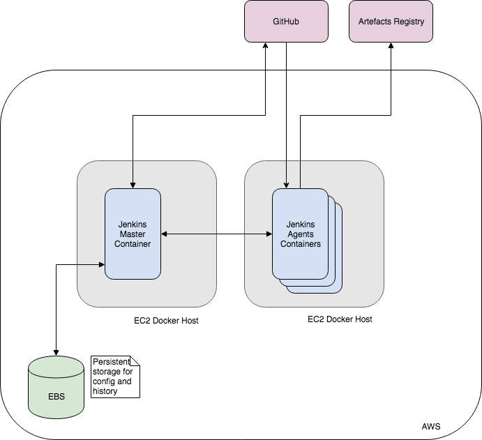
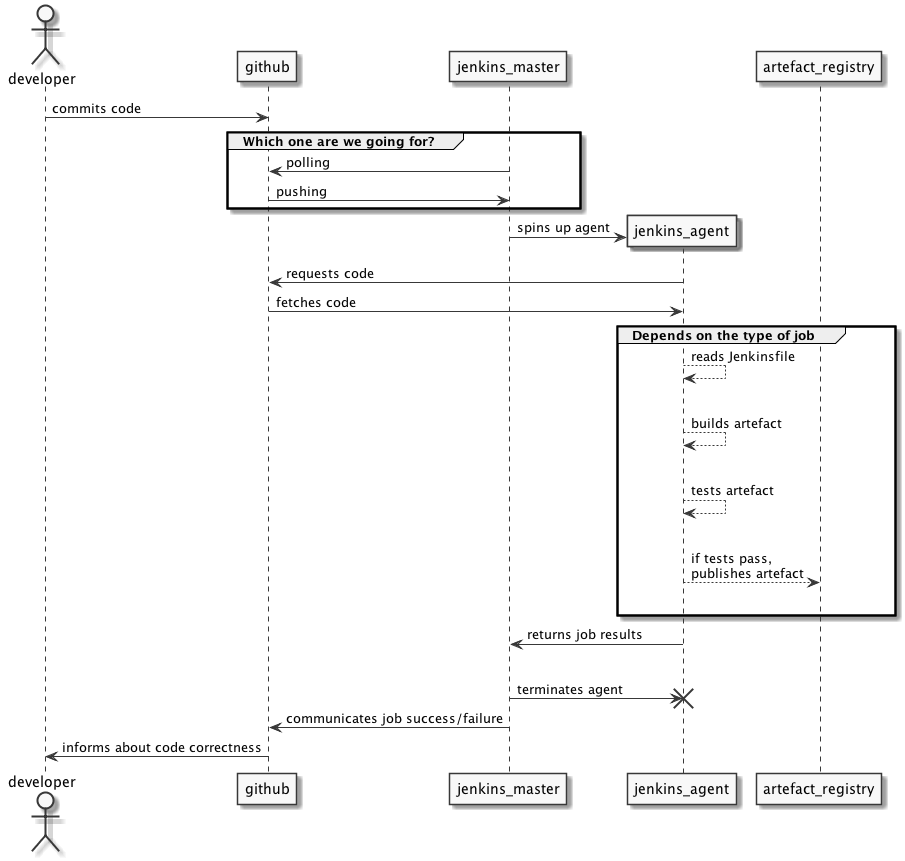

# Architecture

## Architecture Decision Records

We record design decisions for the architecture to ensure we preserve the context of our
choices. These will be written in the format proposed in a
[blog post by Michael Nygard](http://thinkrelevance.com/blog/2011/11/15/documenting-architecture-decisions)

Please see the [decisions directory](decisions/) for a list of all ADRs.

## Architectural diagrams

### Components diagram

Note: this diagram has been created with GSuite - you can find it in the team folder.

### Sequence diagram

This diagram shows the roles that our Jenkins nodes play in the process of building code into artefacts. Note how a Jenkins agent is ephemeral, and its lifecycle is controlled by the Jenkins master node.

Note: this diagram has been generated with [PlantUML](http://plantuml.com/sequence-diagram) - the description is available [here](diagrams/sequence_diagram1.txt).

